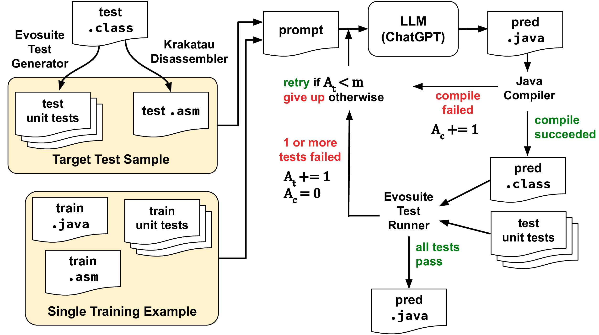

# ChatGPT as a Java Decompiler

This repository contains the implementation and datasets from our GEM 2023 paper "ChatGPT as a Java Decompiler", where we explore using instruction-tuned large language models like ChatGPT to automatically decompile entire Java classes.

## Abstract

We propose a novel approach using instruction-tuned large language models (LLMs), such as ChatGPT, to automatically decompile entire Java classes. Our method relies only on a textual representation of the Java bytecode and corresponding unit tests generated from the bytecode. While no additional domain knowledge or fine-tuning is performed, we provide a single training example of this decompilation process in the model's prompt. To overcome both compilation errors and test failures, we use an iterative prompting approach. We find that ChatGPT-4 is able to generate more human-readable output than existing software-based decompilers while achieving slightly lower pass rates on unit tests.




## Requirements

- Java 8 (specifically OpenJDK 8)
- Java 11 (for certain components)
- Python dependencies in `requirements.txt` 
- Krakatau decompiler
- EvoSuite for test generation
- Various Java decompilers (Procyon, CFR, JADX, Fernflower)

## Repository Structure

```
.
├── jars/                # Required Java dependencies and decompilers
├── krakatau/           # Krakatau decompiler implementation
├── build_dataset.py    # Scripts for dataset creation
├── train_peft.py      # Training script for PEFT models
├── generate.py        # Generation script for trained models
├── generate_codet5p.py # Generation script for CodeT5+ models
├── generate_gpt.py    # Generation script for GPT models
├── java_utils.py      # Java compilation and testing utilities
├── prompts.py         # Prompt templates
└── split_java.py      # Java code splitting utilities
```

## Usage

### 1. Data Collection and Processing

```bash
# Fetch Java source files from BigQuery
python fetch_bq.py --table-path <table> --output-dir data/raw

# Build dataset by compiling and generating tests
python build_dataset.py --input-dir data/raw --output-dir data/processed

# Create train/test splits
python build_train_test_split.py --input-dir data/processed --output-dir data/final
```

### 2. Running Decompilation

For GPT models:
```bash
python generate_gpt.py \
  --input-file data/final/test.json \
  --output-file results/gpt_results.json \
  --model-type gpt-4 \
  --temperature 1.0 \
  --max-attempts 5
```

For CodeT5+ models:
```bash 
python generate_codet5p.py \
  --model-path <model_checkpoint> \
  --input-file data/final/test.json \
  --output-file results/codet5p_results.json \
  --use-cuda
```

### 3. Comparing with Traditional Decompilers

```bash
python comparison.py \
  --data-path data/final/test.json \
  --output-path results/decompiler_results.json
```

### 4. Analyzing Results 

```bash
python result_analysis.py \
  --data-dir results \
  --output-path results/analysis.json
```

## Citation

```bibtex
@inproceedings{mcdanel2023chatgpt,
  title={ChatGPT as a Java Decompiler},
  author={McDanel, Bradley and Liu, Zhanhao},
  booktitle={Proceedings of the Third Workshop on Natural Language Generation, Evaluation, and Metrics (GEM)},
  pages={224--232},
  year={2023}
}
```
